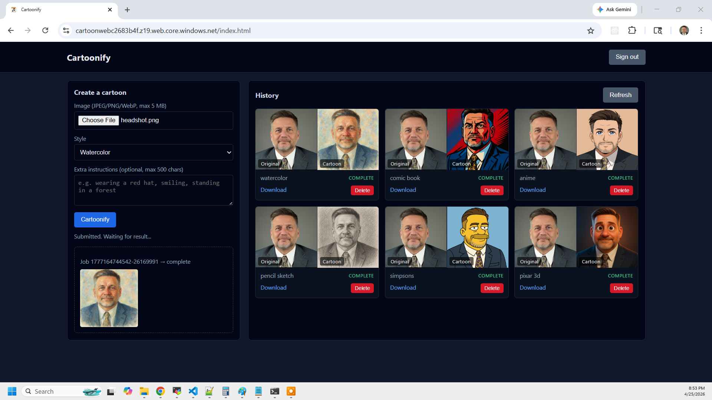

# Azure Cartoonify — Serverless Image-to-Cartoon Service

This project delivers a fully automated **serverless image-to-cartoon service** on
Azure. Users sign in via **Microsoft Entra External ID**, upload a photo, pick a
cartoon style, and a **Service Bus–driven worker** calls the **OpenAI API**
(`gpt-image-1`) to generate a cartoonified version. Results are stored in **Blob
Storage** and accessed via short-lived SAS URLs.



The design follows a **serverless async architecture**: the HTTP API accepts jobs
immediately and returns, a Service Bus queue decouples submission from processing,
and a Function App worker handles the heavy lifting — image normalization via Pillow
and AI image generation via OpenAI.

Key capabilities demonstrated:

1. **Async Job Queue** — Photo upload, job submission, and cartoon generation are
   fully decoupled via Azure Service Bus. The browser polls for completion rather
   than waiting on a long HTTP request.
2. **OpenAI Image Editing** — `gpt-image-1` `images.edit()` takes the uploaded photo
   and a style prompt and returns a cartoonified PNG.
3. **Authenticated API** — All HTTP endpoints require a valid Entra External ID JWT.
   The function code validates the token signature against the Entra JWKS endpoint.
4. **Per-User Data Isolation** — Cosmos DB partition key `/owner` is set from the
   JWT `sub` claim. Users can only read and delete their own jobs.
5. **Blob SAS Tokens** — Direct browser-to-storage upload via write-only SAS URL
   (5 min). Cartoon downloads via read-only SAS URL (4 hours). No API proxying of
   binary data.
6. **Infrastructure as Code** — Terraform provisions all resources in a 3-stage
   deploy. No manual portal configuration beyond the one-time Entra setup.

---

## Architecture

```
Browser → Blob Storage SPA → Entra External ID (PKCE) → sessionStorage (JWT)

Browser → POST /api/upload-url → Function App (JWT) → Blob SAS URL
Browser → PUT (direct) ──────→ Blob Storage (originals/<owner>/<job_id>.<ext>)

Browser → POST /api/generate → Function App (JWT) → Cosmos DB (status=submitted)
                                                  → Service Bus cartoonify-jobs
                                                          ↓
                               Service Bus trigger (cartoonify_worker)
                               • Pillow: EXIF strip, 1024×1024 crop/resize
                               • OpenAI gpt-image-1 images.edit
                               • Blob upload (cartoons/<owner>/<job_id>.png)
                               • Cosmos DB (status=complete)

Browser → GET /api/result/{job_id} → SAS download URLs
Browser → GET /api/history         → newest 50 jobs for owner
Browser → DELETE /api/history/{id} → delete blobs + Cosmos row
```

---

## Prerequisites

### Tools

* [An Azure Account](https://portal.azure.com/)
* [Azure CLI](https://docs.microsoft.com/en-us/cli/azure/install-azure-cli)
* [Terraform](https://developer.hashicorp.com/terraform/install)
* [jq](https://jqlang.github.io/jq/download/)
* [zip](https://linux.die.net/man/1/zip)
* An [OpenAI API key](https://platform.openai.com/api-keys) with access to `gpt-image-1`

### One-time Entra External ID setup (Azure Portal)

The External tenant and user flow must be created manually before the first deploy.
Everything else is automated.

**1. Create a Microsoft Entra External ID tenant**

In the Azure Portal, go to **Microsoft Entra ID → Overview → Manage tenants → New**.
Select **External** as the tenant type. Choose a subdomain name — this becomes
`ENTRA_TENANT_NAME` (e.g. `myapp` from `myapp.onmicrosoft.com`). Note the
**tenant ID (GUID)** from the overview — this is `ENTRA_TENANT_ID`.

**2. Create a sign-up/sign-in user flow**

Switch your portal directory to the External tenant. Go to **Microsoft Entra ID →
External Identities → User flows → New user flow**. Select **Sign up and sign in**.
Under **Identity providers**, select **Email with password**. Under **User
attributes**, collect and return **Email Address**. Click **Create**.

**3. Create a service principal in the Entra External tenant**

Still in the External tenant, go to **App registrations → New registration**. After
creation, go to **Certificates & secrets** and add a client secret. Go to **API
permissions → Add a permission → Microsoft Graph → Application permissions**, add
`Application.ReadWrite.All` and `EventListener.ReadWrite.All`, then click
**Grant admin consent**. Note the **Application (client) ID** (`ENTRA_SP_CLIENT_ID`)
and the secret (`ENTRA_SP_CLIENT_SECRET`).

### Required environment variables

```bash
# Azure subscription
export ARM_CLIENT_ID="..."
export ARM_CLIENT_SECRET="..."
export ARM_SUBSCRIPTION_ID="..."
export ARM_TENANT_ID="..."

# Microsoft Entra External ID
export ENTRA_TENANT_ID="..."          # GUID of the External tenant
export ENTRA_TENANT_NAME="myapp"      # Domain prefix only (no .onmicrosoft.com)
export ENTRA_SP_CLIENT_ID="..."       # Service principal registered IN the External tenant
export ENTRA_SP_CLIENT_SECRET="..."
export ENTRA_USER_FLOW_NAME="..."     # Display name of the sign-up/sign-in user flow

# OpenAI (optional at deploy time — set and re-run apply.sh to activate)
export OPENAI_API_KEY="sk-..."
```

---

## Download this Repository

```bash
git clone https://github.com/mamonaco1973/azure-cartoonify.git
cd azure-cartoonify
```

## Deploy

Run [apply.sh](apply.sh) to provision all infrastructure and deploy the application.

```bash
./apply.sh
```

`apply.sh` runs the following stages in order:

1. **check_env.sh** — validates CLI tools, env vars, and Azure credentials
2. **01-backend** — Service Bus, Cosmos DB, Blob Storage (web + media), Entra app registration
3. **Graph API** — associates the Entra app with the user flow
4. **02-functions** — Function App (FC1 Flex Consumption), RBAC role assignments
5. **Function code deploy** — packages and deploys Python function code via zip deploy
6. **03-webapp** — generates `config.json`, uploads SPA assets to Blob Storage

To tear down all resources:

```bash
./destroy.sh
```

---

## Build Results

When the deployment completes, the following resources are created in `cartoonify-rg`:

- **Azure Service Bus (Standard)**
  - Queue `cartoonify-jobs` — lock duration 3 min, max delivery 10, TTL 7 days
  - RBAC: Function App managed identity has Sender + Receiver roles

- **Azure Cosmos DB**
  - Account with Session consistency
  - Database `cartoonify`, container `jobs`, partition key `/owner`
  - Per-item TTL of 7 days — jobs auto-expire
  - Custom SQL role definition scoped to the Function App identity

- **Blob Storage — media (`cartoonmedia<hex>`)**
  - Containers: `originals` (uploaded photos), `cartoons` (generated output)
  - CORS enabled for direct browser PUT uploads
  - Lifecycle policy: both containers purged after 7 days

- **Blob Storage — web (`cartoonweb<hex>`)**
  - Static website hosting for the SPA
  - Contains `index.html`, `callback.html`, `config.json`, `favicon.ico`

- **Azure Functions (FC1 Flex Consumption)**
  - Python 3.11, 2048 MB instance memory, up to 50 instances
  - 5 HTTP routes + 1 Service Bus queue trigger in a single `function_app.py`
  - System-assigned managed identity for Service Bus and Cosmos DB access
  - CORS locked to the web storage origin

- **Microsoft Entra External ID**
  - App registration `cartoonify-app` (SPA platform, PKCE, no client secret)
  - Redirect URI: `https://<storage>.z1.web.core.windows.net/callback.html`
  - Associated with the sign-up/sign-in user flow via Graph API

---

## API Endpoints

All endpoints require `Authorization: Bearer <id_token>` and return JSON.

| Method | Path | Purpose |
|---|---|---|
| POST | `/api/upload-url` | Get a Blob SAS URL for direct photo upload |
| POST | `/api/generate` | Validate upload, check quota, enqueue job |
| GET | `/api/result/{job_id}` | Poll job status and get SAS download URLs |
| GET | `/api/history` | Newest 50 jobs for the authenticated user |
| DELETE | `/api/history/{job_id}` | Delete job record and associated blobs |

### Cartoon Styles

| Style key | Description |
|---|---|
| `pixar_3d` | Pixar 3D animated portrait |
| `simpsons` | The Simpsons flat cel-shaded |
| `anime` | Japanese anime cel-shading |
| `comic_book` | Marvel comic book illustration |
| `watercolor` | Fine art watercolor portrait |
| `pencil_sketch` | Graphite portrait sketch |

### Job Status Flow

```
submitted → processing → complete
                      ↘ error
```

---

## Project Structure

```
azure-cartoonify/
├── 01-backend/
│   ├── cosmosdb.tf        Cosmos DB account, database, container, custom role
│   ├── entra.tf           Entra app registration (SPA, PKCE, redirect URI)
│   ├── main.tf            Providers, resource group, random suffix
│   ├── openai.tf          (placeholder — Azure OpenAI not used)
│   ├── outputs.tf         All outputs consumed by 02-functions and 03-webapp
│   ├── servicebus.tf      Service Bus namespace and queue
│   ├── storage.tf         Web + media storage accounts, CORS, lifecycle policy
│   └── variables.tf       Location, Entra variables
├── 02-functions/
│   ├── code/
│   │   ├── function_app.py   5 HTTP routes + Service Bus worker
│   │   ├── requirements.txt
│   │   └── host.json
│   ├── functions.tf       Function App, RBAC assignments
│   ├── main.tf            Providers, data sources
│   ├── outputs.tf         function_app_url
│   └── variables.tf       All inputs from 01-backend outputs
├── 03-webapp/
│   ├── callback.html      PKCE auth code exchange
│   ├── favicon.ico
│   ├── index.html.tmpl    SPA — upload, style picker, gallery, polling
│   ├── main.tf
│   └── storage.tf         Blob upload of SPA assets
├── apply.sh               3-stage deploy orchestrator
├── check_env.sh           Tool + env var validation
├── destroy.sh             Reverse teardown
└── validate.sh            Print API + web URLs
```
